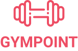

<h1 align="center">
  
</h1>

<h2 align="center">
  Desafio Final para Certificação do Bootcamp GoStack 9.0
</h2>

<h3 align="center">
  PROJETO GYMPOINT: Backend, frontend e mobile
</h3>

Tecnologias: Banco de Dados: PostgresSQL; Backend: Node.js; Frontend: ReactJS; Mobile: React Native.

## INSTRUÇÕES:

### BACKEND
* Instalar Redis
```bash
docker run --name redisgympoint -p 6379:6379 -d -t redis:alpine
```

* Inicializar Redis
```bash
docker start redisgympoint
```

* Instalar PostgreSQL
```bash
docker run --name database -e POSTGRES_PASSWORD=docker -p 5432:5432 -d postgres:12
```

* Inicializar PostgreSQL
```bash
docker start database
```

* Na pasta "backend"  instalar os pacotes e dependências
```bash
yarn install
```

* Faça uma cópia do arquivo .env.example, renomeie para .env e altere as variáveis de acordo com o ambiente implantado.

* Criar estrutura do banco de dados Postgres
```bash
yarn sequelize db:migrate
```

* Povoar o banco de dados
```bash
yarn sequelize db:seed:all
```

* Iniciar servidor da aplicação
```bash
yarn dev
```

* Em outro terminal iniciar servidor de email
```bash
yarn queue
```


### FRONTEND (Testado somente no navegador Web da Google Chrome)
* Na pasta "frontend" instalar os pacotes e dependências
```bash
yarn install
```

* Inicializar a aplicação web
```bash
yarn start
```

### MOBILE (Testado somente na plataforma Android)
* Na pasta "mobile" instalar os pacotes e dependências
```bash
yarn install
```

* Inicializar a aplicação mobile
```bash
react-native run-android
```

#### Agradeço a [Rocketseat](https://rocketseat.com.br/) pelos ensinamentos compartilhados durante todo o bootcamp GoStack 9.0.
